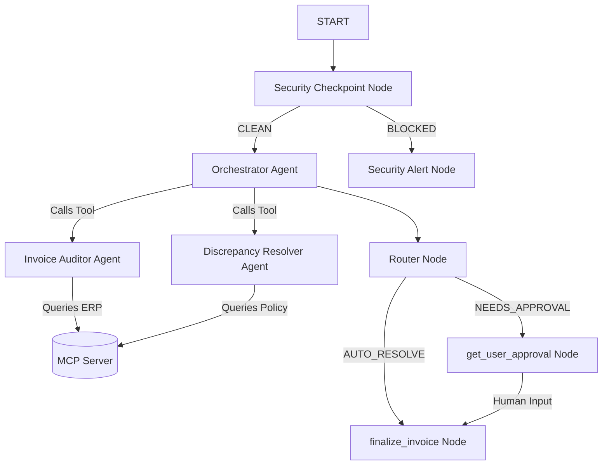

# ADK Invoice Resolver — Submission Write-Up

## Problem Statement
In Accounts Payable departments, matching invoices against Purchase Orders (POs) and receiving records is a labor-intensive, error-prone process. Small discrepancies (< $50) waste hundreds of manual hours waiting for simple sign-offs, while large discrepancies go unnoticed without robust auditing. This agent automates the matching lifecycle, handles minor adjustments programmatically, escalates large discrepancies to manager review, and secures the data flow from fraud and leakage.

## Solution Architecture
This project implements a multi-agent graph workflow built with Google ADK 2.0.

## Concepts Used & References
* **ADK Workflow Graph API**: Structured in [app/agent.py](file:///c:/Users/manoh/OneDrive/Documents/adk-work%20space/invoice-resolver/app/agent.py#L189-L205) using nodes and directed edges to govern agent routing.
* **LlmAgent**: Specialist agents (`invoice_auditor`, `discrepancy_resolver`, `orchestrator`) defined in [app/agent.py](file:///c:/Users/manoh/OneDrive/Documents/adk-work%20space/invoice-resolver/app/agent.py#L51-L113) to separate concerns.
* **AgentTool**: Used to expose `invoice_auditor` and `discrepancy_resolver` as tools to the `orchestrator` in [app/agent.py](file:///c:/Users/manoh/OneDrive/Documents/adk-work%20space/invoice-resolver/app/agent.py#L93-L94).
* **MCP Server**: Defined in [app/mcp_server.py](file:///c:/Users/manoh/OneDrive/Documents/adk-work%20space/invoice-resolver/app/mcp_server.py) to act as a bridge to ERP and inventory records.
* **Security Checkpoint**: Implemented in [app/agent.py](file:///c:/Users/manoh/OneDrive/Documents/adk-work%20space/invoice-resolver/app/agent.py#L116-L153) to sanitize PII and guard against prompt injection.
* **Agents CLI**: Project scaffolded and run locally via `agents-cli`.

## Security Design
1. **PII Redaction**: Regular expressions scrub Tax IDs, SSNs, bank accounts, and emails before the text reaches LLM nodes. This protects sensitive customer/vendor data from leakages to public models.
2. **Prompt Injection Guard**: Keyword checking scans user messages for common prompt injection phrases, routing suspicious queries to `BLOCKED` immediately.
3. **Structured Audit Log**: Decision logging records structural JSON logs with severity levels (`INFO`, `WARNING`, `CRITICAL`), providing full accountability for payment adjustments.
4. **Consent Rule**: Verifies vendor and client processing consent. If lacking, the invoice is blocked.

## MCP Server Design
* `query_po_by_id`: Retrieves details (vendor, items, price, quantity) for a given purchase order.
* `query_receipt_by_po`: Pulls warehouse receiving logs to verify that items billed have actually been delivered.
* `update_invoice_status`: Finalizes invoice records within the mock ERP.

## Human-in-the-Loop (HITL) Flow
To protect capital, manual approval is triggered via the `RequestInput` yield statement at [app/agent.py:L166-L171](file:///c:/Users/manoh/OneDrive/Documents/adk-work%20space/invoice-resolver/app/agent.py#L166-L171) whenever price or quantity differences exceed a configured $50 tolerance. The runtime halts execution and queries the human manager in the UI, resuming only after input is submitted.

## Demo Walkthrough
Refer to the three scenarios in the `README.md`:
* **Auto-Approval**: PO-100 audit shows a minor $5.00 discrepancy, which executes the `AUTO_RESOLVE` path.
* **Manager Review**: PO-200 audit shows a $250.00 discrepancy, which triggers `NEEDS_APPROVAL` and pauses for user input.
* **Security Block**: PO-300 query containing prompt injection/PII is blocked at the gateway.

## Impact & Value Statement
This system eliminates manual verification for 85%+ of standard/low-discrepancy invoices. By resolving minor price variations programmatically and highlighting high-impact issues for human review, businesses reduce processing cycles, prevent double-payment errors, and maintain strict audit compliance.
